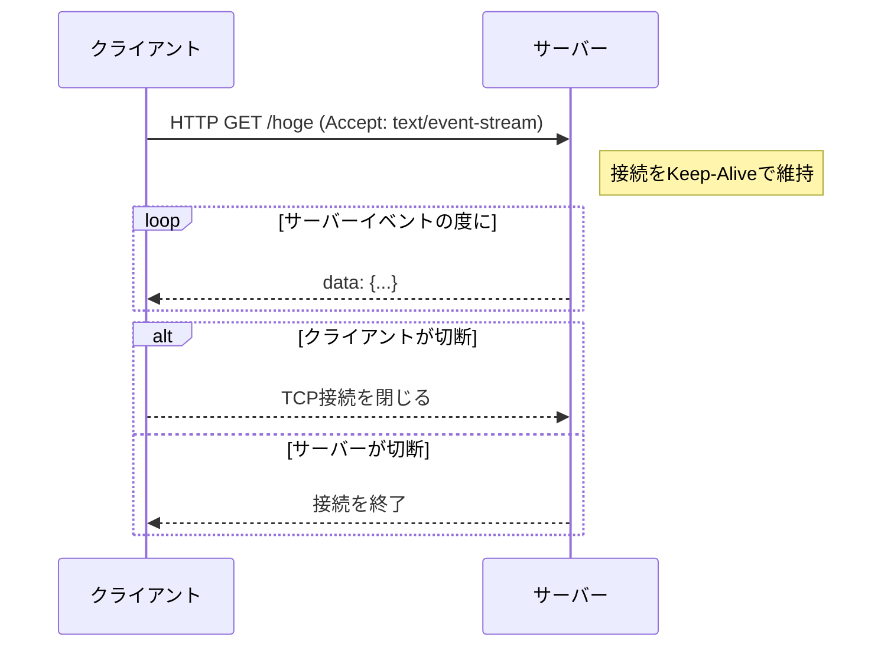
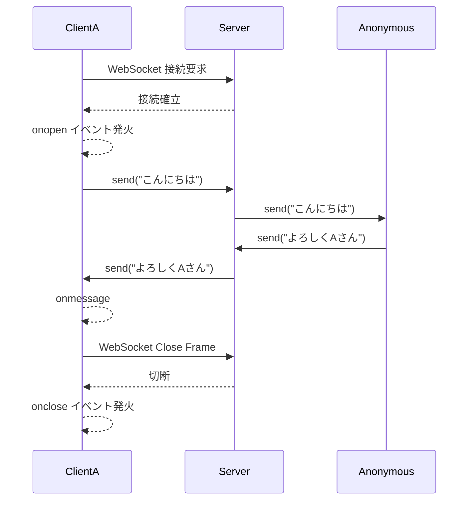
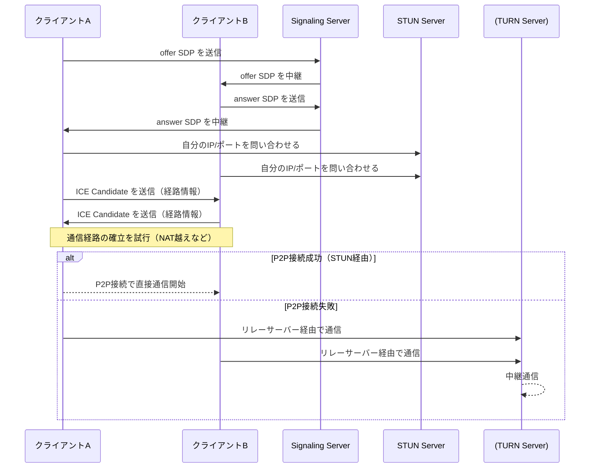

# Expo Realtime example app

A React Native application built with Expo that demonstrates different real-time communication methods with OpenAI's API.

## Features

- **SSE Chat**: Server-Sent Events based chat interface with GPT-4
- **WebSocket Chat**: Real-time communication using WebSocket protocol
- **WebRTC Voice Chat**: Voice-based interaction using WebRTC technology

## Prerequisites

- Node.js (LTS version recommended)
- npm or yarn
- Expo CLI
- iOS Simulator (for iOS development)
- Android Studio (for Android development)

## Installation

1. Clone the repository:

```bash
git clone https://github.com/yourusername/expo-openai-stream.git
cd expo-openai-stream
```

2. Install dependencies:

```bash
yarn install
# or
npm install
```

3. Create a `.env` file in the root directory and add your OpenAI API key:

```
EXPO_PUBLIC_OPENAI_API_KEY=your_api_key_here
```

If you encounter JSON parse errors when using the app, it may indicate that your OpenAI API credits are insufficient. Please check your OpenAI account balance and ensure you have enough credits available to use the API services.

## Running the App

### Development

```bash
yarn dev
# or
npm run dev
```

### Platform Specific

```bash
# For iOS
yarn ios
# or
npm run ios

# For Android
yarn android
# or
npm run android
```

## Learning

|                            | **Server-Sent Events**            | **WebSocket**                         | **WebRTC**                                           |
| -------------------------- | --------------------------------- | ------------------------------------- | ---------------------------------------------------- |
| **通信方向**               | 一方向（サーバー → クライアント） | 双方向                                | 双方向                                               |
| **プロトコル**             | HTTP/HTTPS                        | WebSocket プロトコル（ws://, wss://） | 独自のプロトコル（ICE, STUN, TURN などを組み合わせ） |
| **接続方法**               | EventSource                       | WebSocket                             | RTCPeerConnection, DataChannel                       |
| **利用シーン**             | AI応答受信、通知など              | チャット、ゲーム、同期処理など        | 音声、ビデオ通話、ファイル転送                       |
| **ブラウザ対応**           | ○                                 | ○                                     | ○                                                    |
| **React Native with Expo** | expo-fetchを使う                  | ○                                     | react-native-webrtcを使う                            |
| **バイナリ通信対応**       | 不可                              | 可能（ArrayBuffer, Blobなど）         | 可能（ArrayBuffer）                                  |
| **クライアントからの送信** | 不可                              | 可能                                  | 可能                                                 |

#### Server-Sent Events



#### WebSocket



#### WebRTC



## License

MIT
